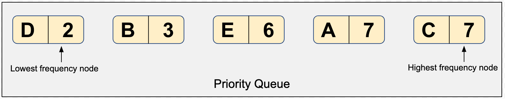
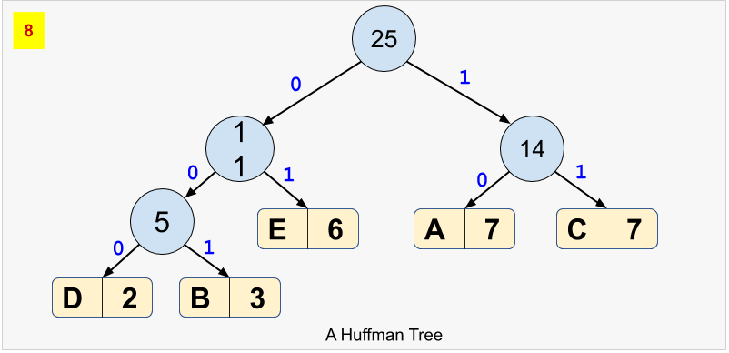

# Problem 3: Huffman Coding

## Overview - Data Compression

In general, a data compression algorithm reduces the amount of memory (bits) required to represent a message (data). The compressed data, in turn, helps to reduce the transmission time from a sender to receiver. The sender encodes the data, and the receiver decodes the encoded data. As part of this problem, you have to implement the logic for both encoding and decoding.

A data compression algorithm could be either _**lossy**_ or _**lossless**_, meaning that when compressing the data, there is a loss (lossy) or no loss (lossless) of information. The **Huffman Coding** is a _lossless_ data compression algorithm. Let us understand the two phases - encoding and decoding with the help of an example.

### A. Huffman Encoding

Assume that we have a string message `AAAAAAABBBCCCCCCCDDEEEEEE` comprising of 25 characters to be encoded. The string message can be an unsorted one as well. We will have two phases in encoding - building the Huffman tree (a binary tree), and generating the encoded data. The following steps illustrate the Huffman encoding:

#### **Phase I - Build the Huffman Tree**

A Huffman tree is built in a bottom-up approach.

1. First, determine the frequency of each character in the message. In our example, the following table presents the frequency of each character.

| (Unique) Character | Frequency |
| ------------------ | --------- |
| A                  | 7         |
| B                  | 3         |
| C                  | 7         |
| D                  | 2         |
| E                  | 6         |

2. Each row in the table above can be represented as a _node_ having a character, frequency, left child, and right child. In the next step, we will repeatedly require to pop-out the node having the lowest frequency. Therefore, build and sort a _list_ of nodes in the order lowest to highest frequencies. Remember that a _list_ preserves the order of elements in which they are appended.

We would need our _list_ to work as a **[priority queue(opens in a new tab)](https://en.wikipedia.org/wiki/Priority_queue)**, where a node that has lower frequency should have a higher priority to be popped-out. The following snapshot will help you visualize the example considered above:



> Can you come up with other data structures to create a priority queue? How about using a _min-heap_ instead of a list? You are free to choose from anyone.

3. Pop-out two nodes with the minimum frequency from the _priority queue_ created in the above step.
4. Create a new node with a frequency equal to the sum of the two nodes picked in the above step. This new node would become an _internal node_ in the Huffman tree, and the two nodes would become the children. The lower frequency node becomes a left child, and the higher frequency node becomes the right child. Reinsert the newly created node back into the priority queue.

**Do you think that this reinsertion requires the sorting of priority queue again?** If yes, then a _min-heap_ could be a better choice due to the lower complexity of sorting the elements, every time there is an insertion.

5. Repeat steps #3 and #4 until there is a single element left in the priority queue. The snapshots below present the building of a Huffman tree.


6. For each node, in the Huffman tree, assign a bit `0` for left child and a `1` for right child. See the final Huffman tree for our example:



#### **Phase II - Generate the Encoded Data**

7. Based on the Huffman tree, generate unique binary code for each character of our string message. For this purpose, you'd have to traverse the path from root to the leaf node.

| (Unique) Character | Frequency | Huffman Code |
| ------------------ | --------- | ------------ |
| D                  | 2         | 000          |
| B                  | 3         | 001          |
| E                  | 6         | 01           |
| A                  | 7         | 10           |
| C                  | 7         | 11           |

> **Points to Notice**

- Notice that the whole code for any character is _**not**_ a prefix of any other code. Hence, the Huffman code is called a _**[Prefix code(opens in a new tab)](https://en.wikipedia.org/wiki/Prefix_code)**_.
- Notice that the binary code is shorter for the more frequent character, and vice-versa.
- The Huffman code is generated in such a way that the entire string message would now require a much lesser amount of memory in binary form.
- Notice that each node present in the original _priority queue_ has become a _leaf node_ in the final Huffman tree.

This way, our encoded data would be `1010101010101000100100111111111111111000000010101010101`

### B. Huffman Decoding

Once we have the encoded data, and the (pointer to the root of) Huffman tree, we can easily decode the encoded data using the following steps:

1. Declare a blank decoded string
2. Pick a bit from the encoded data, traversing from left to right.
3. Start traversing the Huffman tree from the root.
   - If the current bit of encoded data is `0`, move to the left child, else move to the right child of the tree if the current bit is `1`.
   - If a leaf node is encountered, append the (alphabetical) character of the leaf node to the decoded string.
4. Repeat steps #2 and #3 until the encoded data is completely traversed.

You will have to implement the logic for both encoding and decoding in the following template. Also, you will need to create the sizing schemas to present a summary.

```python
import sys

def huffman_encoding(data):
   pass

def huffman_decoding(data,tree):
   pass

if __name__ == "__main__":
   codes = {}
   a_great_sentence = "The bird is the word"
   print(f"The size of the data is: {sys.getsizeof(a_great_sentence)}")
        print(f"The content of the data is: {a_great_sentence}")     encoded_data, tree = huffman_encoding(a_great_sentence)     print(f"The size of the encoded data is: {sys.getsizeof(int(encoded_data, base=2))}")     print(f"The content of the encoded data is: {encoded_data}")     decoded_data = huffman_decoding(encoded_data, tree)     print(f"The size of the decoded data is: {sys.getsizeof(decoded_data)}")     print(f"The content of the encoded data is: {decoded_data}") ## Add your own test cases: include at least three test cases ## and two of them must include edge cases, such as null, empty or very large values ## Test Case 1 ## Test Case 2 ## Test Case 3
```

### Visualization Resource

Check this website to visualize the Huffman encoding for any string message - [Huffman Visualization!(opens in a new tab)](https://people.ok.ubc.ca/ylucet/DS/Huffman.html)

---
